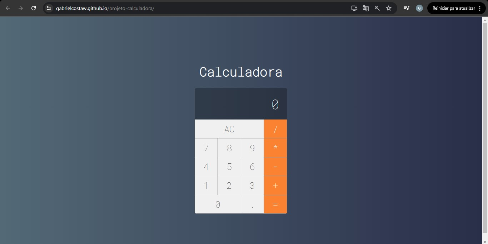

# 🧮 Calculator App - React.js

> **Status do Projeto:** Concluído ✅  
> **Link para demonstração:** [Acesse a Calculadora Online](https://gabrielcostaw.github.io/projeto-calculadora/)

Uma calculadora funcional e moderna desenvolvida com **React.js**. Este projeto demonstra a aplicação de lógica matemática rigorosa combinada com uma estrutura de componentes reutilizáveis e estilização modular.

---

## 🖥️ Demonstração

Confira o visual e o funcionamento da aplicação:



---

## 🛠️ Tecnologias Utilizadas

* **React.js**: Desenvolvimento baseado em Class Components.
* **JavaScript (ES6+)**: Lógica para processamento de operações aritméticas.
* **CSS3**: Organização modular (CSS por componente) para garantir escopo visual definido.
* **Google Fonts**: Tipografia moderna para melhor legibilidade.

---

## 🏗️ Estrutura e Organização

O projeto foi construído seguindo as melhores práticas de componentização para facilitar a manutenção:

* **Calculator.jsx**: Componente "Cérebro" que detém a lógica de estado (`initialState`) e as funções de operação.
* **Button & Display**: Componentes de interface (UI) totalmente independentes e reutilizáveis.
* **Lógica de Estado**: Implementação de lógica para lidar com múltiplas operações, ponto flutuante e limpeza de memória.

---

## 🧠 Conceitos Aplicados 

Como estudante, utilizei este projeto para dominar conceitos fundamentais do ecossistema React:
1.  **Estado Inicial**: Uso de um objeto `initialState` para resetar a calculadora de forma eficiente.
2.  **Propagação de Dados**: Fluxo de dados e funções via `props` dos pais para os componentes filhos.
3.  **Binding**: Manipulação de contexto de funções usando `.bind(this)` no construtor para garantir a execução correta da lógica.
4.  **Estilização Modular**: Cada componente possui seu próprio arquivo `.css`, evitando conflitos de estilo (CSS Scoping).

---

## 🚀 Como executar localmente

```bash
# 1. Clone o repositório
$ git clone [https://github.com/gabrielcostaw/projeto-calculadora.git](https://github.com/gabrielcostaw/projeto-calculadora.git)

# 2. Entre na pasta
$ cd projeto-calculadora

# 3. Instale as dependências
$ npm install

# 4. Inicie a aplicação
$ npm start


Estou em busca da minha primeira oportunidade como **Estagiário de Desenvolvimento**. Se você gostou deste projeto ou quer trocar uma ideia sobre tecnologia, sinta-se à vontade para me chamar!

* **LinkedIn:** [Gabriel Costa dos Santos](https://www.linkedin.com/in/gabriel-costa-228ab0382/)
* **E-mail:** [gcstsantos@gmail.com]
* **GitHub:** [gbcostaw](https://github.com/gabrielcostaw)